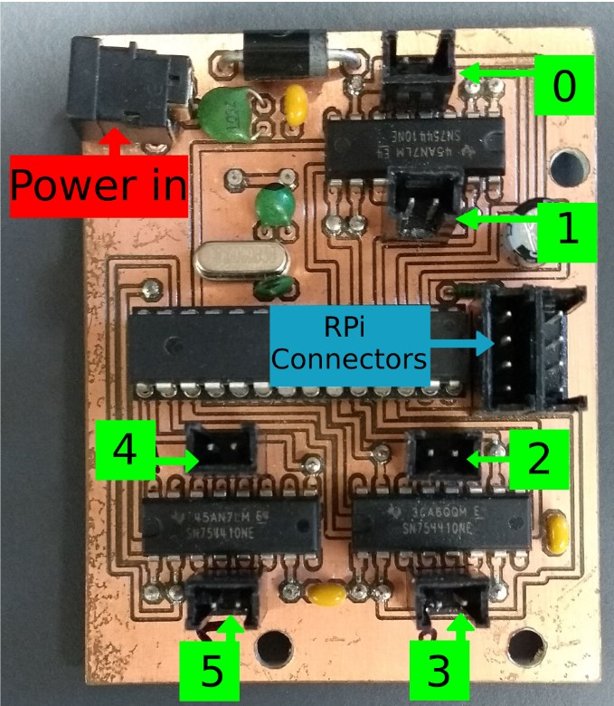
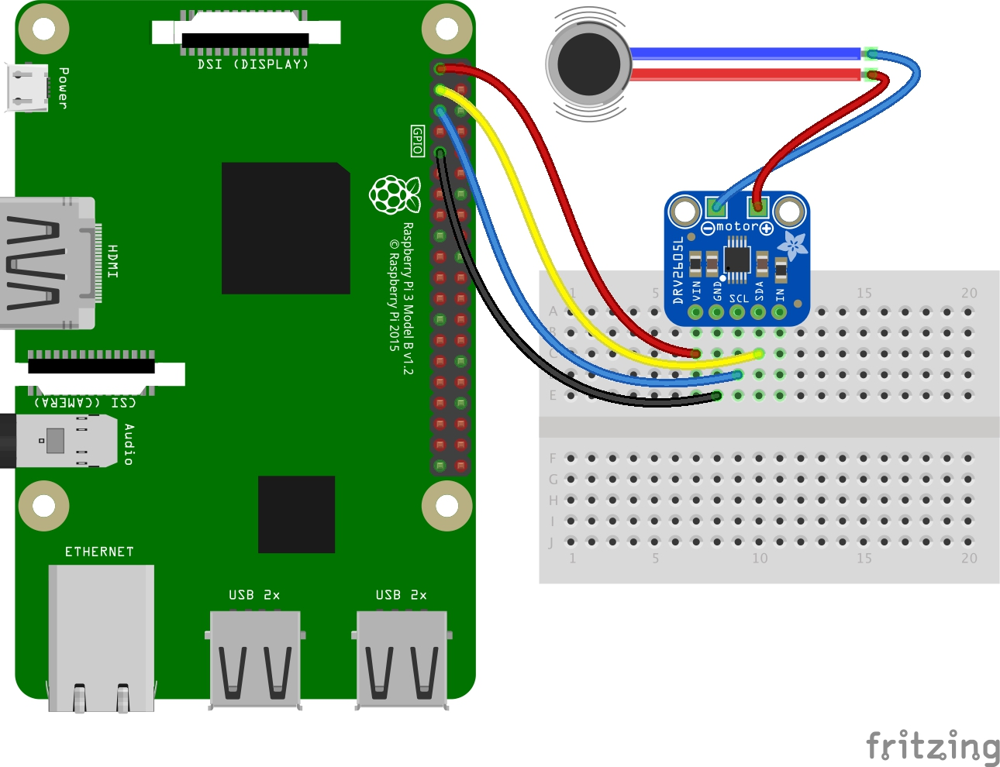

## Connecting to Pi
1.ssh into DICE account (use -XC for forwading graphics)
```
ssh -XC s1234567@student.ssh.inf.ed.ac.uk
```

2.ssh into Pi with password `r00t`
```
ssh -XC pi@abomasnow
``` 

## Current Connections
check what's on the 12c bus by `i2cdetect -y 1`
### Camera
To access the camera: use `vlc` on pi. 

Media - open_capture_device

Video device name = video1

Video standard = All

### The old motor board
on port 0x04 and is already configured in the `motors` library. LED bulbs are connected on port 1 to 5



Follow this guide to make motors move:http://www.inf.ed.ac.uk/teaching/courses/sdp/SDP2020/sdp_rpi_guide.pdf

### The new haptic driver board
Adafruit DRV2605L Haptic Controller Breakout on the other active port (relevant libraries are already installed by Garry)



Follow this guide to see how to communicate with the board:
https://learn.adafruit.com/adafruit-drv2605-haptic-controller-breakout/python-circuitpython
